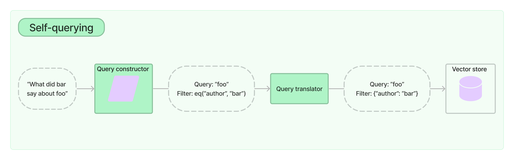

:::info Prerequisites

This guide assumes familiarity with the following concepts:

- [Retrievers](../../docs/concepts#retrievers)
- [Vector stores](../../docs/concepts#vectorstores)

:::

A self-querying retriever is one that, as the name suggests, has the
ability to query itself. Specifically, given any natural language query,
the retriever uses an LLM to write a structured query and then applies
that structured query to its underlying vector store. This allows the
retriever to not only use the user-input query for semantic similarity
comparison with the contents of stored documents but to also extract
filters from the user query on the metadata of stored documents and to
execute those filters.



Head to [Integrations](../../docs/integrations/retrievers/self_query)
for documentation on vector stores with built-in support for
self-querying.

## Get started

For demonstration purposes, we’ll use an in-memory, unoptimized vector
store. You should swap it out for a supported production-ready vector
store when seriously building.

The self-query retriever requires you to have the
[`peggy`](https://www.npmjs.com/package/peggy) package installed as a
peer dep, and we’ll also use OpenAI for this example:

```mdx-code-block
import Npm2Yarn from '@theme/Npm2Yarn';

<Npm2Yarn>
  peggy @langchain/openai
</Npm2Yarn>
```

We’ve created a small demo set of documents that contain summaries of
movies:

```typescript
import "peggy";
import { Document } from "@langchain/core/documents";

/**
 * First, we create a bunch of documents. You can load your own documents here instead.
 * Each document has a pageContent and a metadata field. Make sure your metadata matches the AttributeInfo below.
 */
const docs = [
  new Document({
    pageContent:
      "A bunch of scientists bring back dinosaurs and mayhem breaks loose",
    metadata: {
      year: 1993,
      rating: 7.7,
      genre: "science fiction",
      length: 122,
    },
  }),
  new Document({
    pageContent:
      "Leo DiCaprio gets lost in a dream within a dream within a dream within a ...",
    metadata: {
      year: 2010,
      director: "Christopher Nolan",
      rating: 8.2,
      length: 148,
    },
  }),
  new Document({
    pageContent:
      "A psychologist / detective gets lost in a series of dreams within dreams within dreams and Inception reused the idea",
    metadata: { year: 2006, director: "Satoshi Kon", rating: 8.6 },
  }),
  new Document({
    pageContent:
      "A bunch of normal-sized women are supremely wholesome and some men pine after them",
    metadata: {
      year: 2019,
      director: "Greta Gerwig",
      rating: 8.3,
      length: 135,
    },
  }),
  new Document({
    pageContent: "Toys come alive and have a blast doing so",
    metadata: { year: 1995, genre: "animated", length: 77 },
  }),
  new Document({
    pageContent: "Three men walk into the Zone, three men walk out of the Zone",
    metadata: {
      year: 1979,
      director: "Andrei Tarkovsky",
      genre: "science fiction",
      rating: 9.9,
    },
  }),
];
```

### Creating our self-querying retriever

Now we can instantiate our retriever. To do this we’ll need to provide
some information upfront about the metadata fields that our documents
support and a short description of the document contents.

```typescript
import { OpenAIEmbeddings, OpenAI } from "@langchain/openai";
import { FunctionalTranslator } from "@langchain/core/structured_query";
import { MemoryVectorStore } from "langchain/vectorstores/memory";
import { SelfQueryRetriever } from "langchain/retrievers/self_query";
import type { AttributeInfo } from "langchain/chains/query_constructor";

/**
 * We define the attributes we want to be able to query on.
 * in this case, we want to be able to query on the genre, year, director, rating, and length of the movie.
 * We also provide a description of each attribute and the type of the attribute.
 * This is used to generate the query prompts.
 */
const attributeInfo: AttributeInfo[] = [
  {
    name: "genre",
    description: "The genre of the movie",
    type: "string or array of strings",
  },
  {
    name: "year",
    description: "The year the movie was released",
    type: "number",
  },
  {
    name: "director",
    description: "The director of the movie",
    type: "string",
  },
  {
    name: "rating",
    description: "The rating of the movie (1-10)",
    type: "number",
  },
  {
    name: "length",
    description: "The length of the movie in minutes",
    type: "number",
  },
];

/**
 * Next, we instantiate a vector store. This is where we store the embeddings of the documents.
 * We also need to provide an embeddings object. This is used to embed the documents.
 */
const embeddings = new OpenAIEmbeddings();
const llm = new OpenAI();
const documentContents = "Brief summary of a movie";
const vectorStore = await MemoryVectorStore.fromDocuments(docs, embeddings);
const selfQueryRetriever = SelfQueryRetriever.fromLLM({
  llm,
  vectorStore,
  documentContents,
  attributeInfo,
  /**
   * We need to use a translator that translates the queries into a
   * filter format that the vector store can understand. We provide a basic translator
   * translator here, but you can create your own translator by extending BaseTranslator
   * abstract class. Note that the vector store needs to support filtering on the metadata
   * attributes you want to query on.
   */
  structuredQueryTranslator: new FunctionalTranslator(),
});
```

### Testing it out

And now we can actually try using our retriever!

We can ask questions like “Which movies are less than 90 minutes?” or
“Which movies are rated higher than 8.5?”. We can also ask questions
like “Which movies are either comedy or drama and are less than 90
minutes?”. The translator within the retriever will automatically
convert these questions into vector store filters that can be used to
retrieve documents.

```typescript
await selfQueryRetriever.invoke("Which movies are less than 90 minutes?");
```

```text
[
  Document {
    pageContent: "Toys come alive and have a blast doing so",
    metadata: { year: 1995, genre: "animated", length: 77 }
  }
]
```

```typescript
await selfQueryRetriever.invoke("Which movies are rated higher than 8.5?");
```

```text
[
  Document {
    pageContent: "A psychologist / detective gets lost in a series of dreams within dreams within dreams and Inception"... 16 more characters,
    metadata: { year: 2006, director: "Satoshi Kon", rating: 8.6 }
  },
  Document {
    pageContent: "Three men walk into the Zone, three men walk out of the Zone",
    metadata: {
      year: 1979,
      director: "Andrei Tarkovsky",
      genre: "science fiction",
      rating: 9.9
    }
  }
]
```

```typescript
await selfQueryRetriever.invoke("Which movies are directed by Greta Gerwig?");
```

```text
[
  Document {
    pageContent: "A bunch of normal-sized women are supremely wholesome and some men pine after them",
    metadata: { year: 2019, director: "Greta Gerwig", rating: 8.3, length: 135 }
  }
]
```

```typescript
await selfQueryRetriever.invoke(
  "Which movies are either comedy or drama and are less than 90 minutes?"
);
```

```text
[
  Document {
    pageContent: "Toys come alive and have a blast doing so",
    metadata: { year: 1995, genre: "animated", length: 77 }
  }
]
```

## Next steps

You’ve now seen how to use the `SelfQueryRetriever` to to generate
vector store filters based on an original question.

Next, you can check out the list of [vector stores that currently
support self-querying](../../docs/integrations/retrievers/self_query/).
