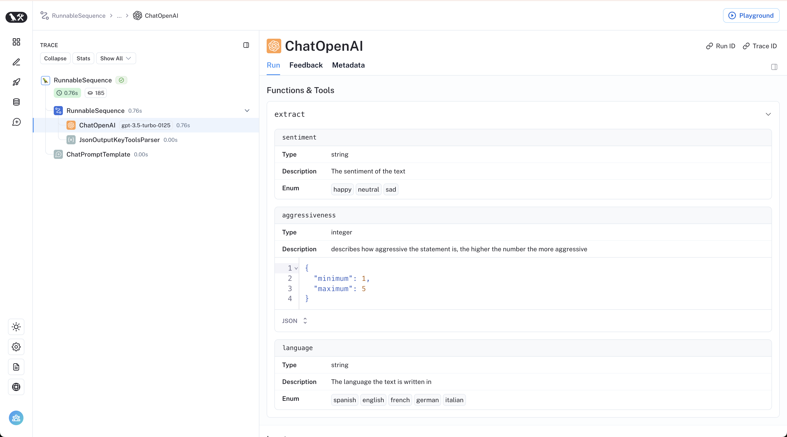

# 텍스트를 라벨로 분류하기

Tagging means labeling a document with classes such as:

- sentiment
- language
- style (formal, informal etc.)
- covered topics
- political tendency

<figure>
  
  <figcaption aria-hidden="true">Image description</figcaption>
</figure>

## Overview

Tagging has a few components:

- `function`: Like [extraction](../../docs/tutorials/extraction),
  tagging uses
  [functions](https://openai.com/blog/function-calling-and-other-api-updates)
  to specify how the model should tag a document
- `schema`: defines how we want to tag the document

## Quickstart

Let’s see a very straightforward example of how we can use OpenAI tool
calling for tagging in LangChain. We’ll use the
`.withStructuredOutput()` method supported by OpenAI models:

```mdx-code-block
import Npm2Yarn from "@theme/Npm2Yarn"

<Npm2Yarn>
  langchain @langchain/openai @langchain/core zod
</Npm2Yarn>
```

Let’s specify a [Zod](https://zod.dev) schema with a few properties and
their expected type in our schema.

```typescript
import { ChatPromptTemplate } from "@langchain/core/prompts";
import { ChatOpenAI } from "@langchain/openai";
import { z } from "zod";

const taggingPrompt = ChatPromptTemplate.fromTemplate(
  `Extract the desired information from the following passage.

Only extract the properties mentioned in the 'Classification' function.

Passage:
{input}
`
);

const classificationSchema = z.object({
  sentiment: z.string().describe("The sentiment of the text"),
  aggressiveness: z
    .number()
    .int()
    .min(1)
    .max(10)
    .describe("How aggressive the text is on a scale from 1 to 10"),
  language: z.string().describe("The language the text is written in"),
});

// LLM
const llm = new ChatOpenAI({
  temperature: 0,
  model: "gpt-3.5-turbo-0125",
});
// Name is optional, but gives the models more clues as to what your schema represents
const llmWihStructuredOutput = llm.withStructuredOutput(classificationSchema, {
  name: "extractor",
});

const taggingChain = taggingPrompt.pipe(llmWihStructuredOutput);
```

```typescript
const input =
  "Estoy increiblemente contento de haberte conocido! Creo que seremos muy buenos amigos!";
await taggingChain.invoke({ input });
```

```text
{ sentiment: "positive", aggressiveness: 1, language: "Spanish" }
```

As we can see in the example, it correctly interprets what we want.

The results vary so that we may get, for example, sentiments in
different languages (‘positive’, ‘enojado’ etc.).

We will see how to control these results in the next section.

## Finer control

Careful schema definition gives us more control over the model’s output.

Specifically, we can define:

- possible values for each property
- description to make sure that the model understands the property
- required properties to be returned

Let’s redeclare our Zod schema to control for each of the previously
mentioned aspects using enums:

```typescript
import { z } from "zod";

const classificationSchema = z.object({
  sentiment: z
    .enum(["happy", "neutral", "sad"])
    .describe("The sentiment of the text"),
  aggressiveness: z
    .number()
    .int()
    .min(1)
    .max(5)
    .describe(
      "describes how aggressive the statement is, the higher the number the more aggressive"
    ),
  language: z
    .enum(["spanish", "english", "french", "german", "italian"])
    .describe("The language the text is written in"),
});
```

```typescript
const taggingPrompt = ChatPromptTemplate.fromTemplate(
  `Extract the desired information from the following passage.

Only extract the properties mentioned in the 'Classification' function.

Passage:
{input}
`
);

// LLM
const llm = new ChatOpenAI({
  temperature: 0,
  model: "gpt-3.5-turbo-0125",
});
const llmWihStructuredOutput = llm.withStructuredOutput(classificationSchema, {
  name: "extractor",
});

const chain = taggingPrompt.pipe(llmWihStructuredOutput);
```

Now the answers will be restricted in a way we expect!

```typescript
const input =
  "Estoy increiblemente contento de haberte conocido! Creo que seremos muy buenos amigos!";
await chain.invoke({ input });
```

```text
{ sentiment: "happy", aggressiveness: 3, language: "spanish" }
```

```typescript
const input = "Estoy muy enojado con vos! Te voy a dar tu merecido!";
await chain.invoke({ input });
```

```text
{ sentiment: "sad", aggressiveness: 5, language: "spanish" }
```

```typescript
const input =
  "Weather is ok here, I can go outside without much more than a coat";
await chain.invoke({ input });
```

```text
{ sentiment: "neutral", aggressiveness: 3, language: "english" }
```

The [LangSmith
trace](https://smith.langchain.com/public/455f5404-8784-49ce-8851-0619b99e936f/r)
lets us peek under the hood:


